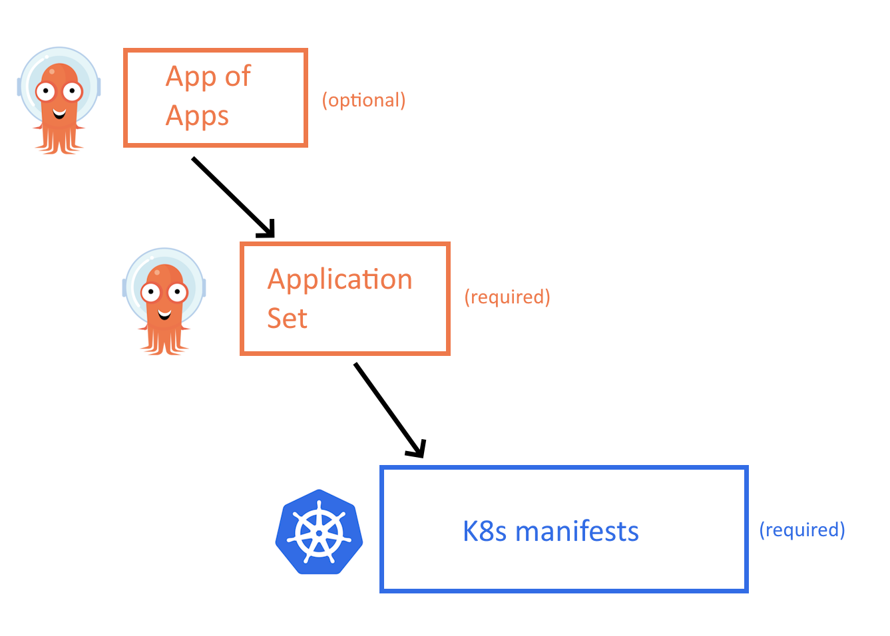
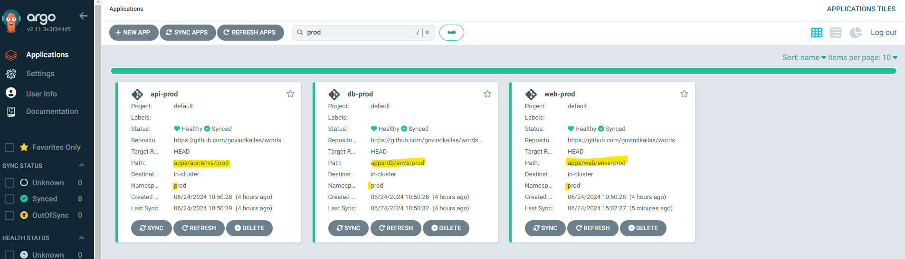

# Wordsmith App

Wordsmith is the demo project originally shown at DockerCon EU 2017 and 2018.

The demo app runs across three containers:

- **[api](api/Dockerfile)** - a Java REST API which serves words read from the database
- **[web](web/Dockerfile)** - a Go web application that calls the API and builds words into sentences
- **db** - a Postgres database that stores words

## Architecture


## Build and run in Docker Compose

The only requirement to build and run the app from source is Docker. Clone this repo and use Docker Compose to build all the images. You can use the new V2 Compose with `docker compose` or the classic `docker-compose` CLI:

```shell
docker compose up --build
```

Or you can pull pre-built images from Docker Hub using `docker compose pull`.


## Deploy using Kubernetes manifests

You can deploy the same app to Kubernetes using the [Kustomize configuration](./kustomization.yaml). It will define all of the necessary Deployment and Service objects and a ConfigMap to provide the database schema.

Apply the manifest using `kubectl` while at the root of the project:

```shell
kubectl apply -k .
```

Once the pods are running, browse to http://localhost:8080 and you will see the site.

Docker Desktop includes Kubernetes and the [kubectl](https://kubernetes.io/docs/reference/kubectl/overview/) command line, so you can work directly with the cluster. Check the services are up, and you should see output like this:

```text
kubectl get svc
NAME         TYPE           CLUSTER-IP       EXTERNAL-IP   PORT(S)          AGE
db           ClusterIP      None             <none>        55555/TCP        2m
kubernetes   ClusterIP      10.96.0.1        <none>        443/TCP          38d
web          LoadBalancer   10.107.215.211   <pending>     8080:30220/TCP   2m
words        ClusterIP      None             <none>        55555/TCP        2m
```

Check the pods are running and you should see one pod each for the database and web components and five pods for the words API:

```text
kubectl get pods
NAME                   READY     STATUS    RESTARTS   AGE
db-8678676c79-h2d99    1/1       Running   0          1m
web-5d6bfbbd8b-6zbl8   1/1       Running   0          1m
api-858f6678-6c8kk     1/1       Running   0          1m
api-858f6678-7bqbv     1/1       Running   0          1m
api-858f6678-fjdws     1/1       Running   0          1m
api-858f6678-rrr8c     1/1       Running   0          1m
api-858f6678-x9zqh     1/1       Running   0          1m
```


## ArgoCD 
We can make it even better by implementing ArgoCD, it's inspired by the best practices mentioned in [this blog post ](https://codefresh.io/blog/how-to-structure-your-argo-cd-repositories-using-application-sets/)

### Install ArgoCD

To install ArgoCD, follow the official [installation guide](https://argo-cd.readthedocs.io/en/stable/getting_started/). ArgoCD is a declarative, GitOps continuous delivery tool for Kubernetes.


## ArgoCD App of Apps
To utilize ArgoCD in all it's capabilities let's use the 3-level structure as shown in the image below


At the lowest level, keep all the k8s yaml/helm. One level above we have Application Set which wraps all the k8s manifest into ArgoCd apps. This should be sufficient to go for now. The next level is optional, but it allows you to bootstrap all the apps in the cluster. 

To deploy all the apps to the cluster, run the below, 
```
kubectl apply -f root-argocd-app.yaml 
```

You can also deploy apps based on env, for example, to deploy apps to `dev`
```
kubectl apply -f argo-appsets/dev-appset.yaml
```

With Argo we deploy the same set of apps to 3 environments dev, stage and prod. Base/common settings of the apps go to base and `env` specific configs go under envs.

## Automation from the CI pipeline

```
git clone https://github.com/govindkailas/wordsmith.git
cd wordsmith

# kustomize
kustomize edit set image wordsmith-api:v2.0

# plain yaml
kubectl patch --local -f apps/api/deploy-svc.yaml -p '{"spec":{"template":{"spec":{"containers":[{"name":"api","image":"dockersamples/wordsmith-api:v2.0"}]}}}}' -o yaml

git add . -m "Update api to v2.0"
git push
```

After this ArgoCD will detect the change and auto sync the env based on your configuration.


## Controlling which app to be deployed on an environment
You can also control the app you want to deploy based on `envs` under the `apps`. For example, api is deployed on all envs and web is deployed only in stage and prod.



## ArgoCD References
- https://github.com/kostis-codefresh/many-appsets-demo.git 
- https://codefresh.io/blog/how-to-structure-your-argo-cd-repositories-using-application-sets/ 
